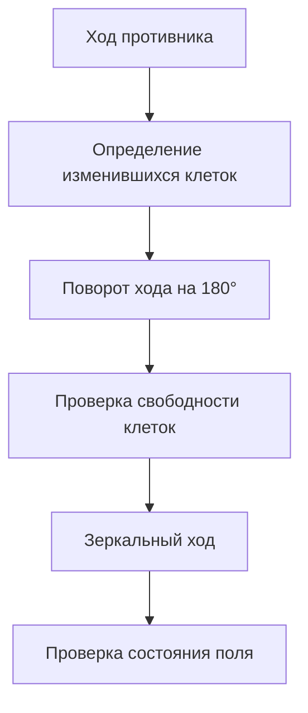

# Тестовое задание — Промпт-инженер

Репозиторий содержит решение двух обязательных тестовых заданий на позицию стажёра по направлению **Prompt Engineer**.

В работе продемонстрированы два подхода к проектированию промптов:

1. генерация структурированных тест-кейсов по функциональным требованиям;
2. разработка системного промпта для игрового AI-агента.

---

## Содержание

- [Задание 1 — Генерация тест-кейсов](#задание-1--генерация-тест-кейсов)
  - [Цель](#цель)
  - [Выбор модели](#выбор-модели)
  - [Подход к проектированию промпта](#подход-к-проектированию-промпта)
  - [Структура результата](#структура-результата)
  - [Результат](#результат)
  - [Сильные стороны](#сильные-стороны)
  - [Слабые стороны](#слабые-стороны)
  - [Масштабирование](#масштабирование)
- [Задание 2 — Игровой AI-агент](#задание-2--игровой-ai-агент)
  - [Цель](#цель-1)
  - [Анализ игры](#анализ-игры)
  - [Стратегия](#стратегия)
  - [Проектирование системного промпта](#проектирование-системного-промпта)
  - [Контроль корректности](#контроль-корректности)
  - [Формат ответа](#формат-ответа)
- [Итог](#итог)
- [Материалы](#материалы)

---

# Задание 1 — Генерация тест-кейсов

## Цель

Требуется разработать промпт, который по функциональным требованиям мобильного приложения автоматически создаёт структурированные тест-кейсы с предусловиями, шагами и ожидаемыми результатами.

Основная задача при разработке промпта — получить не просто список возможных проверок, а воспроизводимый и пригодный для дальнейшей работы QA-инженера результат.

---

## Выбор модели

Для решения задачи предполагается использование **Mistral-Small-3.1-24B-Instruct-2503**.

Модель выбрана с учётом характера задачи:

- необходимо следовать достаточно большому набору инструкций;
- требуется структурированный вывод;
- важно минимизировать случайные отклонения от заданного формата;
- задача не требует специализированного vision или tool-use поведения.

Для подобных задач предпочтительно использовать низкую температуру, чтобы сделать генерацию более стабильной и воспроизводимой.

---

## Подход к проектированию промпта

В качестве роли модели задан:

> Senior QA Engineer и специалист по анализу требований мобильных приложений.

Промпт разделён на несколько логических блоков:

1. основные правила генерации;
2. правила приоритизации;
3. требуемый формат результата;
4. дополнительные проверки;
5. входные данные.

Особое внимание уделено контролю поведения модели.

### Ограничение выдуманной функциональности

Модель получает явную инструкцию:

> Основывай тест-кейсы только на предоставленных требованиях.

и:

> Не придумывай функциональность, которой нет в требованиях.

Это позволяет снизить количество сценариев, основанных на предположениях модели.

### Обработка неоднозначных требований

Если из требования нельзя однозначно определить ожидаемое поведение приложения, тест помечается как:

`Требует уточнения`

При этом модель должна указать, какое именно поведение необходимо уточнить.

Таким образом, LLM используется не только для генерации тестов, но и как инструмент обнаружения неполноты требований.

### Покрытие требований

Для каждого функционального требования модель должна создать хотя бы один позитивный тест-кейс.

Дополнительно для важных функций генерируются негативные и граничные сценарии.

### Декомпозиция тест-кейсов

Каждый тест-кейс проверяет одну конкретную характеристику.

Это позволяет избежать больших сценариев, в которых одновременно проверяется несколько независимых функций.

---

## Структура результата

Перед тест-кейсами модель формирует таблицу покрытия:

| ID требования | Требование | Количество тест-кейсов |
|---|---|---:|
| TR-001 | Регистрация пользователя | 3 |
| TR-002 | Авторизация пользователя | 2 |
| ... | ... | ... |

Каждый тест-кейс имеет следующую структуру:

```text
TC-XXX — Название

Требование: ID требования

Приоритет: Critical / High / Medium / Low

Тип: Positive / Negative / Boundary / UI / Usability

Предусловия:
- ...

Шаги:
1. ...
2. ...
3. ...

Ожидаемый результат:
- ...

Статус требования: Проверено / Требует уточнения
```

Такой формат делает результат единообразным и позволяет в дальнейшем автоматически обрабатывать сгенерированные тест-кейсы.

---

## Результат

В результате тестового прогона модель сформировала таблицу покрытия и набор тест-кейсов для предоставленного набора требований.

В частности, были покрыты сценарии:

- регистрации;
- авторизации;
- ввода текстовых данных;
- смены пароля;
- редактирования пользовательской информации;
- добавления записей в лог;
- редактирования записей;
- удаления записей;
- поиска;
- сортировки.

Полный результат работы модели доступен в файле:

[response.md](https://github.com/inxrius/pet-projects/blob/main/infotecs/intership/task1/response.md)

---

## Сильные стороны

### 1. Трассируемость

Каждый тест-кейс связан с конкретным функциональным требованием.

Это позволяет быстро определить, какие требования покрыты и сколько тестов приходится на каждое из них.

### 2. Структурированный вывод

Формат ответа заранее задан в промпте.

За счёт этого результаты разных запусков можно сравнивать и дополнительно обрабатывать программно.

### 3. Разные типы тестирования

Промпт предусматривает:

- Positive;
- Negative;
- Boundary;
- UI;
- Usability.

Это позволяет получать не только сценарии успешного использования.

### 4. Контроль галлюцинаций

Модель явно ограничена исходными требованиями и не должна придумывать функциональность, которая в них отсутствует.

### 5. Выявление неоднозначностей

Статус "Требует уточнения" позволяет не подменять отсутствующую спецификацию предположением модели.

---

## Слабые стороны

Основное ограничение подхода — зависимость качества результата от качества исходных требований.

Если спецификация не определяет поведение приложения, модель не может достоверно восстановить бизнес-логику без дополнительного контекста.

Также возможны следующие ограничения:

- дублирование похожих тест-кейсов;
- недостаточно подробные проверки UI;
- отсутствие технических проверок, которые не описаны в требованиях;
- необходимость дополнительной проверки сгенерированных тестов человеком.

Поэтому LLM в данном сценарии рассматривается как инструмент ускорения работы QA-инженера, а не как полная замена ручной валидации.

---

## Масштабирование

Для генерации большого количества тестов целесообразно использовать многоэтапный pipeline:

- Функциональные требования
- Декомпозиция требований
- Генерация сценариев
- Позитивные тесты
- Негативные тесты
- Граничные случаи
- UI/UX тесты
- Интеграционные сценарии
- Удаление дубликатов
- Проверка покрытия
- Финальный набор тест-кейсов

Такой подход предпочтительнее генерации 100+ тестов одним запросом.

Каждый этап может иметь собственный промпт и критерии валидации.

Дополнительно можно автоматически проверять:

- наличие связи теста с требованием;
- отсутствие дубликатов;
- корректность структуры;
- полноту покрытия;
- распределение тестов по приоритетам;
- наличие позитивных и негативных сценариев.

---

# Задание 2 — Игровой AI-агент

## Цель

Требуется разработать системный промпт для агента, который играет против другого AI-агента в игре на поле 4×4.

Игроки по очереди заполняют клетки поля.

За один ход можно заполнить любое положительное количество свободных клеток одной строки или одного столбца, не пересекая уже занятые клетки.

Игрок, который заполняет последнюю свободную клетку, проигрывает.

Для проверки используются:

- Gemma-4-31B
- temperature=0.15
- max_tokens=512

---

## Анализ игры

Перед разработкой системного промпта была проанализирована сама игровая механика.

Ключевое наблюдение — возможность использовать центральную симметрию поля.

Для каждой клетки существует симметричная ей клетка относительно центра поля:

(1,1) ↔ (4,4) \
(1,2) ↔ (4,3) \
(1,3) ↔ (4,2) \
(1,4) ↔ (4,1) 

(2,1) ↔ (3,4) \
(2,2) ↔ (3,3) \
(2,3) ↔ (3,2) \
(2,4) ↔ (3,1)

---

## Стратегия

Если агент играет вторым, используется стратегия центральной симметрии.

После каждого хода противника агент:

1. определяет клетки, добавленные противником;
2. применяет к каждой из них поворот на 180°;
3. проверяет, что соответствующие клетки свободны;
4. заполняет именно эти клетки;
5. проверяет получившееся состояние поля.

Схематично стратегия выглядит следующим образом:



После ответного хода поле сохраняет центральную симметрию.

Таким образом, стратегия переводит поиск оптимального хода из задачи свободного рассуждения LLM в конкретный алгоритм преобразования состояния.

---

## Проектирование системного промпта

Основная идея — не просить модель самостоятельно искать выигрышную стратегию.

Вместо этого стратегия явно задаётся в системном промпте.

Промпт содержит:

- правила игры;
- допустимый формат поля;
- таблицу симметричных клеток;
- алгоритм ответного хода;
- проверки корректности;
- обработку системных ошибок;
- ограничения на формат ответа.

Особое внимание уделено фразе:

`NEVER change any additional cells.`

Агент должен изменять только клетки, полученные после преобразования хода противника.

Это позволяет сохранить инвариант симметрии.

---

## Контроль корректности

Перед каждым ответом агент должен проверить:

1. поле содержит ровно 4 строки;
2. каждая строка содержит ровно 4 клетки;
3. каждая клетка содержит 0 или 1;
4. ранее занятые клетки не изменяются;
5. ход заполняет хотя бы одну новую клетку;
6. ход соответствует правилам игры;
7. при игре вторым ход является 180°-отражением хода противника.

Дополнительно в промпте указано, что состояние поля является источником истины:

`The board state is authoritative.`

Это позволяет избежать зависимости от предыдущих текстовых сообщений агента.

## Формат ответа

Для снижения риска ошибок парсинга агент должен выводить только итоговое состояние поля.

Например:

text
```
|0|1|1|1|
|0|0|0|0|
|0|0|0|0|
|1|1|1|0|
```

Дополнительные объяснения, координаты и анализ в ответе не требуются.

Это особенно важно, поскольку система автоматически проверяет формат поля и сообщает агенту об ошибке при некорректном ответе.

---

## Обработка ошибок

В системный промпт добавлена инструкция на случай сообщений:

`[System error: was unable to find the new board in the reply ...]`

или

`[System error: the provided move is invalid.]`

В случае ошибки агент должен заново проанализировать текущее состояние поля и сформировать корректный ответ.

При этом он не должен спорить с системой или продолжать предыдущую стратегию без проверки актуального состояния поля.

---

# Итог

В рамках тестового задания были реализованы два разных сценария применения prompt engineering.

В первом задании основной акцент сделан на преобразовании неструктурированных функциональных требований в формализованный набор тест-кейсов.

Основными механизмами являются:

- роль модели;
- строгие правила генерации;
- трассируемость требований;
- фиксированная структура тест-кейсов;
- разделение типов тестирования;
- контроль неоднозначных требований.

Во втором задании сначала была решена алгоритмическая часть задачи, после чего найденная стратегия была формализована в системном промпте.

Основными механизмами являются:

- явное описание алгоритма;
- фиксация состояния;
- инвариант центральной симметрии;
- валидация каждого хода;
- строгий формат вывода;
- обработка ошибок среды.

Таким образом, в обоих заданиях промпт рассматривается не просто как инструкция для модели, а как способ управления поведением LLM через явные правила, ограничения, структуру вывода и проверки результата.

# Материалы

Все материалы тестового задания находятся в GitHub:

### Задание 1

[Промпт](https://github.com/inxrius/pet-projects/blob/main/infotecs/intership/task1/prompt.md) — системный промпт для генерации тест-кейсов.

[Результат](https://github.com/inxrius/pet-projects/blob/main/infotecs/intership/task1/response.md) — результат тестового прогона.

### Задание 2

[Промпт](https://github.com/inxrius/pet-projects/blob/main/infotecs/intership/task2/prompt.md) — системный промпт игрового AI-агента.
